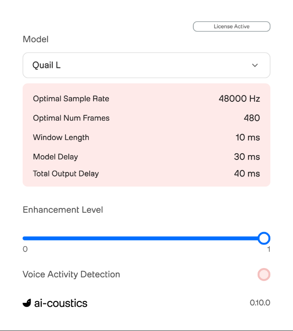

# ai-coustics SDK Demo Plugin

Demo audio plug-in for the [ai-coustics Speech Enhancement SDK](https://ai-coustics.com/quail).

    

For comprehensive documentation, visit [docs.ai-coustics.com](https://docs.ai-coustics.com).

> [!NOTE]
> This plug-in requires a license key. Generate your key at [developers.ai-coustics.com](https://developers.ai-coustics.com).

## Documentation

- **Full Documentation**: [docs.ai-coustics.com](https://docs.ai-coustics.com)
- **Rust API Reference**: [docs.rs/aic-sdk](https://docs.rs/aic-sdk)
- **Available Models**: [artifacts.ai-coustics.io](https://artifacts.ai-coustics.io)

## Licenses

The source code in this repo is licensed under the Apache 2.0 license, which does not include the AIC-SDK (downloaded at compile time), the JUCE framework, which is licensed under the [proprietary JUCE license](https://juce.com/legal/juce-7-license/), and the items in the assets folder, namely [aic-logo.svg](assets/aic_logo.svg) and [aic-font.otf](assets/aic_font.otf), which are licensed under our [proprietary ai-coustics license](LICENSE.AIC-SDK). You are in no means allowed to copy or redistribute the logo and/or font in the assets folder.
