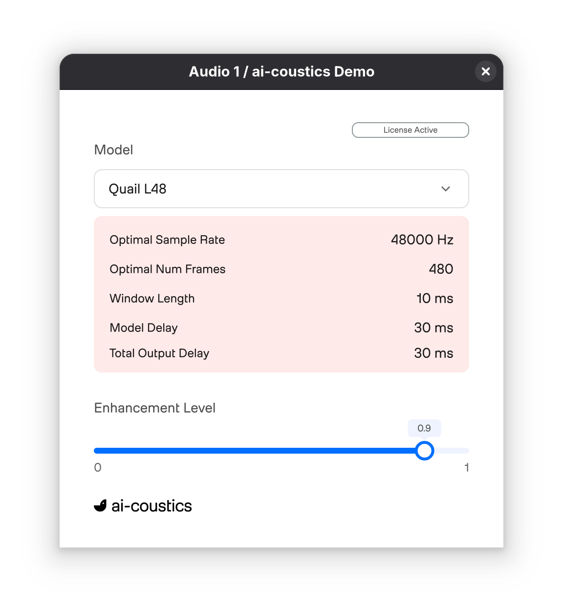

# ai-coustics SDK Demo Plugin

    

Experience our state-of-the-art speech enhancement technology firsthand with the ai-coustics Demo Plugin - a comprehensive audio plugin that provides instant access to all models in our Speech Enhancement SDK. Built for professional audio workflows, our SDK delivers cutting-edge real-time audio processing that dramatically improves speech clarity, reduces noise, and enhances intelligibility across any audio content.

## What is this Plugin?

The Demo Plugin provides:
- **Real-time audio processing** with instant A/B comparison
- **All model variants** available for testing and evaluation
- **Integration example** demonstrating best practices
- **Cross-platform compatibility** (VST3, AU)

## Installation

Download the newest release [here](https://github.com/ai-coustics/aic-sdk-plugin/releases) and follow the instructions in the [InstallationGuide.md](release/InstallationGuide.md).

### Acquire an SDK License Key

To use the SDK, you'll need a license key. Contact our team to receive your time-limited demo key:

- **Email**: [info@ai-coustics.com](mailto:info@ai-coustics.com)
- **Website**: [ai-coustics.com](https://ai-coustics.com)

Once you have your license key, set it as an environment variable or pass it directly to the SDK initialization functions.

## Build your own Application

If you want to integrate the SDK in your application you can use our language bindings:

| Language | Repository | Description |
|----------|------------|-------------|
| **C** | [`aic-sdk-c`](https://github.com/ai-coustics/aic-sdk-c) | Core C interface and foundation |
| **C++** | [`aic-sdk-cpp`](https://github.com/ai-coustics/aic-sdk-cpp) | Modern C++ wrapper with RAII and type safety |
| **Node.js** | [`aic-sdk-node`](https://github.com/ai-coustics/aic-sdk-node) | JavaScript/TypeScript bindings for Node.js |
| **Python** | [`aic-sdk-py`](https://github.com/ai-coustics/aic-sdk-py) | Pythonic interface |
| **Rust** | [`aic-sdk-rs`](https://github.com/ai-coustics/aic-sdk-rs) | Safe Rust Bindings |
| **WebAssembly** | [`aic-sdk-wasm`](https://github.com/ai-coustics/aic-sdk-wasm) | Browser-compatible WebAssembly build |

## Support & Resources

Need help? We're here to assist:

- **Issues**: [GitHub Issues](https://github.com/ai-coustics/aic-sdk-plugin/issues)
- **Technical Support**: [info@ai-coustics.com](mailto:info@ai-coustics.com)

Feel free to reach out to us if you encounter any issues or need further assistance.

## Licenses

The source code in this repo is licensed under the Apache 2.0 license, which does not include the AIC-SDK (downloaded at compile time), the JUCE framework, which is licensed under the [proprietary JUCE license](https://juce.com/legal/juce-7-license/), and the items in the assets folder, namely [aic-logo.svg](assets/aic_logo.svg) and [aic-font.otf](assets/aic_font.otf), which are licensed under our [proprietary ai-coustics license](LICENSE.AIC-SDK). You are in no means allowed to copy or redistribute the logo and/or font in the assets folder.

---

Made with ❤️ by the ai-coustics team
